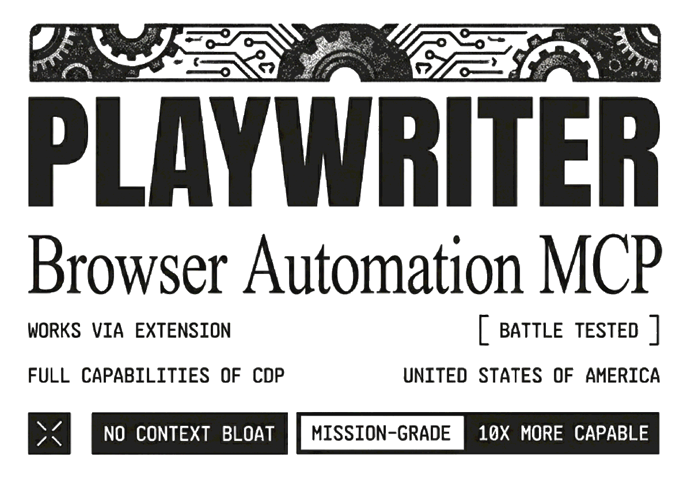

<div align='center'>
    <br/>
    <picture>
        <source media="(prefers-color-scheme: dark)" srcset="banner-dark.png" />
        <source media="(prefers-color-scheme: light)" srcset="banner.png" />
    
    </picture>
    <br/>
    <br/>
    <p>Let your agents control your own Chrome, via CLI or MCP. Your logins, extensions, cookies — already there.</p>
    <br/>
</div>

Other browser MCPs spawn a fresh Chrome — no logins, no extensions, instantly flagged by bot detectors, double the memory. Playwriter connects to **your running browser** instead. One Chrome extension, full Playwright API, everything you're already logged into.

## Installation

1. [**Install Extension**](https://chromewebstore.google.com/detail/playwriter/jfeammnjpkecdekppnclgkkffahnhfhe) from Chrome Web Store

2. Click extension icon on a tab → turns green when connected

3. Install the CLI and start automating the browser:

   ```bash
   npm i -g playwriter
   playwriter -s 1 -e 'state.page = await context.newPage(); await state.page.goto("https://example.com")'
   ```

4. Install the skill so your agent knows how to use Playwriter:
   ```bash
   npx -y skills add https://playwriter.dev
   ```

## Quick Start

```bash
playwriter browser start  # starts Chrome for Testing/Chromium with bundled Playwriter extension
playwriter session new  # creates stateful sandbox, outputs session id (e.g. 1)
playwriter -s 1 -e 'state.page = await context.newPage(); await state.page.goto("https://example.com")'
playwriter -s 1 -e 'console.log(await snapshot({ page: state.page }))'
playwriter -s 1 -e 'await state.page.locator("aria-ref=e5").click()'
```

> **Tip:** Always use single quotes for `-e` to prevent bash from interpreting `$`, backticks, and `\` in your JS code. Use double quotes for strings inside the JS.

## CLI Usage

Each session has **isolated state**. Browser tabs are **shared** across sessions.

```bash
# Browser management
playwriter browser start             # auto-finds Chrome for Testing or Chromium, with recording flags enabled
playwriter browser start /path/to/browser-binary

# Session management
playwriter session new              # creates stateful sandbox, outputs id (e.g. 1)
playwriter session new --tab-group agent1 --tab-group-color blue
playwriter session update 1 --tab-group research
playwriter session list             # show sessions + state keys + group
playwriter session reset <id>       # fix connection issues

# Execute (always use -s)
playwriter -s 1 -e 'state.page = await context.newPage(); await state.page.goto("https://example.com")'
playwriter -s 1 -e 'await state.page.click("button")'
playwriter -s 1 -e 'console.log(await state.page.title())'
```

There is no default `page`. Create your own tab and store it in `state`. To use a tab the user already opened, find it by URL:

```bash
playwriter -s 1 -e 'state.page = context.pages().findLast((p) => p.url().includes("github.com"))'
```

### Tab groups

Local extension sessions use a Chrome **tab group** named `playwriter` by default. Remote-control sessions move the shared tab into `remote`. Use the shortest clear single-word name with no spaces, such as `docs`, `shop`, `test`, or `scrape`.

```bash
# Park a long scrape in its own group. The user can Move group to new window
# (or another screen). New tabs from this session follow that group.
playwriter session new --tab-group scrape --tab-group-color grey

# Split concurrent agents so many open tabs stay readable
playwriter session new --tab-group agent1 --tab-group-color blue
playwriter session new --tab-group agent2 --tab-group-color pink

# Name a group the user can collapse when they don't care about it
playwriter session new --tab-group done --tab-group-color grey

# Rename or recolor later
playwriter session update 1 --tab-group research
playwriter session update 1 --tab-group-color red

# Remote tabs support the same title and color options
playwriter session new --remote <id> --tab-group support
playwriter session update 1 --tab-group review --tab-group-color cyan
```

`--tab-group-color` accepts: `grey`, `blue`, `red`, `yellow`, `green`, `pink`, `purple`, `cyan`, `orange`. Without it, color is derived from the name. The default local `playwriter` group stays green.

Node programs should use `connectViaExtension()` instead of posting `/cli/session/new` themselves:

```ts
import { connectViaExtension } from 'playwriter'

await using connection = await connectViaExtension({
  tabGroup: 'email-check',
  tabGroupColor: 'grey',
})
const page = await connection.browser.contexts()[0].newPage()
await page.goto('https://example.com')
// connection closes automatically when the scope ends, also on throw
```

`tabGroupColor` is typed as Chrome's tab group colors. `await using` calls `close()` at scope end: it closes leftover pages, disconnects CDP, and deletes the session. Without `await using`, call `await connection.close()` in `finally`.

Multiline:

```bash
playwriter -s 1 -e $'
const title = await state.page.title();
console.log({ title, url: state.page.url() });
'
```

## Examples

Variables in scope: `context`, `state` (persists between calls), `cloud` (local CLI sessions), `require`, `importModule`, native `import()`, and Node.js globals. Relative imports resolve from the session working directory. There is no default `page`; examples below assume `state.page` was set as shown above.

**Persist data in state:**

```bash
playwriter -e "state.users = await state.page.$$eval('.user', els => els.map(e => e.textContent))"
playwriter -e "console.log(state.users)"
```

**Intercept network requests:**

```bash
playwriter -e "state.requests = []; state.page.on('response', r => { if (r.url().includes('/api/')) state.requests.push(r.url()) })"
playwriter -e "await Promise.all([state.page.waitForResponse(r => r.url().includes('/api/')), state.page.click('button')])"
playwriter -e "console.log(state.requests)"
```

**Set breakpoints and debug:**

```bash
playwriter -e "state.cdp = await getCDPSession({ page: state.page }); state.dbg = createDebugger({ cdp: state.cdp }); await state.dbg.enable()"
playwriter -e "state.scripts = await state.dbg.listScripts({ search: 'app' }); console.log(state.scripts.map(s => s.url))"
playwriter -e "await state.dbg.setBreakpoint({ file: state.scripts[0].url, line: 42 })"
```

**Live edit page code:**

```bash
playwriter -e "state.cdp = await getCDPSession({ page: state.page }); state.editor = createEditor({ cdp: state.cdp }); await state.editor.enable()"
playwriter -e "await state.editor.edit({ url: 'https://example.com/app.js', oldString: 'const DEBUG = false', newString: 'const DEBUG = true' })"
```

**Screenshot with labels:**

```bash
playwriter -e "await screenshotWithAccessibilityLabels({ page: state.page })"
```

**Live stream a tab to X Live / Twitch (RTMP, runs 24/7):**

```bash
playwriter -s 1 -e "state.page = await context.newPage(); await state.page.goto('https://example.com')"
playwriter stream start -s 1 --rtmp rtmp://va.pscp.tv:80/x/<stream-key>
playwriter stream status -s 1
playwriter stream stop -s 1
```

## MCP Setup

Using the CLI with the skill (step 4 above) is the recommended approach. For direct MCP server configuration, see [MCP.md](./MCP.md).

## Visual Labels

Vimium-style labels for AI agents to identify elements:

```javascript
await screenshotWithAccessibilityLabels({ page: state.page })
// Returns screenshot + accessibility snapshot with aria-ref selectors
await state.page.locator('aria-ref=e5').click()
```

Color-coded: yellow=links, orange=buttons, coral=inputs, pink=checkboxes, peach=sliders, salmon=menus, amber=tabs.

## Comparison

### vs Playwright MCP

|               | Playwriter                        | Playwright MCP                       |
| ------------- | --------------------------------- | ------------------------------------ |
| Browser       | **Uses your Chrome**              | Separate managed profile by default  |
| Extensions    | Your existing ones                | None by default                      |
| Login state   | Already logged in                 | Persistent, but a separate profile   |
| Attach to your Chrome | Core design               | `--extension` mode                   |
| Bot handling  | Real browser (disconnect to solve) | Managed automation profile          |
| Native video / raw CDP | Yes                      | Trace-based / not exposed            |

> **Note:** Playwriter video recording is **100x more efficient than Playwright video recording**, which sends **base64 images for every frame**.

|                 | Playwriter                    | Playwright CLI                     |
| --------------- | ----------------------------- | ---------------------------------- |
| Browser         | **Uses your Chrome**          | New browser by default             |
| Login state     | Already logged in             | Persistent profile, separate       |
| Extensions      | Your existing ones            | None by default                    |
| Captchas        | Disconnect extension to solve | Managed automation profile         |
| Programmable JS | `execute` with persistent state | `run-code` (no cross-call state) |
| Raw CDP access  | First-class                   | Not exposed                        |
| Native video    | `chrome.tabCapture` (30–60fps) | Trace / screencast based          |

### vs BrowserMCP

|               | Playwriter               | BrowserMCP          |
| ------------- | ------------------------ | ------------------- |
| Tools         | **1 `execute` tool**     | 12+ dedicated tools |
| API           | Full Playwright          | Limited actions     |
| Context usage | Low                      | High (tool schemas) |
| LLM knowledge | Already knows Playwright | Must learn tools    |

### vs agent-browser

|                    | Playwriter                     | agent-browser                    |
| ------------------ | ------------------------------ | -------------------------------- |
| Browser            | **Uses your Chrome**           | Fresh Chrome for Testing         |
| API surface        | 1 `execute` + full Playwright  | 50+ CLI commands, one per action |
| Actions per turn   | Real JS (loops, conditions)    | `batch` of command strings       |
| Reusable logic     | Import a `.js` function         | Re-run bash sequences            |
| Skill recorder     | Yes                            | No                               |
| Cloud browsers     | Built-in stealth + proxy       | Plugin only                      |
| Remote control tab | Yes (Devin, cloud bots)        | No                               |

### vs Antigravity (Jetski)

|          | Playwriter       | Jetski                       |
| -------- | ---------------- | ---------------------------- |
| Tools    | **1 tool**       | 17+ tools                    |
| Subagent | Direct execution | Spawns for each browser task |
| Latency  | Low              | High (agent overhead)        |

### vs Claude Browser Extension

|                      | Playwriter              | Claude Extension     |
| -------------------- | ----------------------- | -------------------- |
| Agent support        | **Any MCP client**      | Claude only          |
| Windows WSL          | Yes                     | No                   |
| Context method       | A11y snapshots (5-20KB) | Screenshots (100KB+) |
| Playwright API       | Full                    | No                   |
| Debugger/breakpoints | Yes                     | No                   |
| Live code editing    | Yes                     | No                   |
| Network interception | Full                    | Limited              |
| Raw CDP access       | Yes                     | No                   |

### vs Built-in Chrome CDP (`--remote-debugging-port`)

|                       | Playwriter                   | Built-in CDP                                       |
| --------------------- | ---------------------------- | -------------------------------------------------- |
| Setup                 | **Click extension icon**     | Relaunch Chrome with special flags                 |
| Your real profile     | Yes                          | Blocked on default profile since Chrome 136        |
| Permission prompt     | None                         | "Allow remote debugging?" dialog agents can't click|
| Autonomous agents     | Fully autonomous             | Blocked by dialog / throwaway profile              |
| Existing session      | Uses your running browser    | Must relaunch Chrome (lose state)                  |

> Chrome's `--remote-debugging-port` is ignored on your default profile since **Chrome 136**, so you must use a throwaway `--user-data-dir` with none of your logins. Connecting an external CDP client also shows an "Allow remote debugging?" dialog an agent cannot click. Playwriter uses an in-Chrome extension instead: no dialog, no flags, your real profile.

## Architecture

```
+---------------------+     +-------------------+     +-----------------+
|   BROWSER           |     |   LOCALHOST       |     |   MCP CLIENT    |
|                     |     |                   |     |                 |
|  +---------------+  |     | WebSocket Server  |     |  +-----------+  |
|  |   Extension   |<--------->  :19988         |     |  | AI Agent  |  |
|  +-------+-------+  | WS  |                   |     |  +-----------+  |
|          |          |     |  /extension       |     |        |        |
|    chrome.debugger  |     |       |           |     |        v        |
|          v          |     |       v           |     |  +-----------+  |
|  +---------------+  |     |  /cdp/:id <--------------> |  execute  |  |
|  | Tab 1 (green) |  |     +-------------------+  WS |  +-----------+  |
|  | Tab 2 (green) |  |                               |        |        |
|  | Tab 3 (gray)  |  |     Tab 3 not controlled      |  Playwright API |
+---------------------+     (no extension click)      +-----------------+
```

## Remote Control (share a tab with a remote agent)

Let a remote agent (Devin, a cloud bot, a friend's CLI agent) drive **one tab of your own browser** — no playwriter install needed on your machine, only the extension.

1. Click the light-blue **Remote control** cloud button and confirm that the agent may read and control the tab
2. A prompt containing a secret tunnel URL is copied to your clipboard — paste it to the agent
3. The agent runs `playwriter session new --remote <id>` on its machine
4. Open **Remote ON** and click **Stop sharing** anytime to **revoke**. The URL dies instantly.

Opening that same link in **any browser** shows a live, clickable view of the tab, so you can share with a person instead of an agent. The viewer page receives no tunnel id in its initial HTTP request because the id starts in the URL fragment. Its JavaScript then uses the id to connect to the tunnel path (`/tunnel/{id}/extension`), keeping the id out of DNS and TLS SNI.

```
YOUR MACHINE (extension only)                        AGENT MACHINE (any box with npx)
┌───────────────────────────┐                       ┌────────────────────────────────┐
│ Chrome + Extension        │   Cloudflare tunnel   │ playwriter CLI + local relay   │
│  shared tab ◄─────────────┼───◄ playwriter.dev ◄──┼────── session new --remote     │
└───────────────────────────┘   /remote-control#id  └────────────────────────────────┘
```

The shared tab is the **starting control surface**, not a security sandbox. Remote CDP access is powerful, so share the link only with a person or agent you fully trust. A short denylist blocks new-tab creation, explicit whole-profile cookie APIs, and obvious destructive clears, but it does not make a malicious recipient safe. The URL contains 128 bits of randomness and is never reusable after revocation.

Scope enforcement is **best effort**, not a sandbox. The shared tab can navigate to other pages in your browser (including extension pages), and CDP evaluation there can reach other tabs and profile data. Expect that anyone you give a remote URL to can access more than the one shared tab.

Use case: you are logged into a website and want an agent to do work in your authenticated session without giving it your password.

## Remote Access

Control Chrome on a remote machine over the internet using [traforo](https://traforo.dev) tunnels:

**On host:**

```bash
npx -y traforo -p 19988 -t my-machine -- npx -y playwriter serve --token <secret>
```

**From remote:**

```bash
export PLAYWRITER_HOST=https://my-machine-tunnel.traforo.dev
export PLAYWRITER_TOKEN=<secret>
playwriter -s 1 -e 'state.page = await context.newPage(); await state.page.goto("https://example.com")'
```

Also works on a LAN without traforo (`PLAYWRITER_HOST=192.168.1.10`). Full guide with use cases (remote Mac mini, user support, multi-machine control): [docs/remote-access.md](./docs/remote-access.md)

## Security

- **Local by default**: The normal WebSocket relay stays on `localhost:19988`. Traffic leaves your machine only when you enable Remote control or configure remote access.
- **Origin validation**: Only our extension IDs allowed (browsers can't spoof Origin)
- **Controlled tab scope**: Tabs are controlled after an extension click. Playwriter never opens a tab on its own. New tabs are created only when code calls `context.newPage()`.
- **Visible automation**: Chrome shows automation banner on controlled tabs
- **No remote access**: Malicious websites cannot connect

## Playwright API

Connect programmatically (without CLI):

```typescript
import { chromium } from 'playwright-core'
import { startPlayWriterCDPRelayServer, getCdpUrl } from 'playwriter'

const server = await startPlayWriterCDPRelayServer()
const browser = await chromium.connectOverCDP(getCdpUrl())
const page = await browser.contexts()[0].newPage()

await page.goto('https://example.com')
await page.screenshot({ path: 'screenshot.png' })
// Don't call browser.close() - it closes the user's Chrome
server.close()
```

Or connect to a running server:

```bash
npx -y playwriter serve --host 127.0.0.1
```

```typescript
const browser = await chromium.connectOverCDP('http://127.0.0.1:19988')
```

## Troubleshooting

View relay server logs to debug issues:

```bash
playwriter logfile  # prints the log file path
# typically: ~/.playwriter/relay-server.log
```

The relay log contains extension, MCP and WebSocket server logs. A separate CDP JSONL log is also created alongside it (see `playwriter logfile`). Both are recreated on each server start.

Example: summarize CDP traffic counts by direction + method:

```bash
jq -r '.direction + "\t" + (.message.method // "response")' ~/.playwriter/cdp.jsonl | uniq -c
```

## Development Setup

To build and run Playwriter from source:

**Prerequisites:** [Node.js](https://nodejs.org/), [pnpm](https://pnpm.io/), and [bun](https://bun.sh/) installed.

```bash
# 1. Clone and bootstrap (inits git submodule, installs deps, builds playwright-core)
git clone https://github.com/remorses/playwriter.git
cd playwriter
pnpm run bootstrap

# 2. Build playwriter and the extension
pnpm run build

# 3. Link the CLI globally for local development
cd playwriter
pnpm link --global

# Verify
playwriter --help
```

For development with auto-rebuild:

```bash
pnpm run watch
```

## Support

If Playwriter is useful to you, consider [sponsoring the project](https://github.com/sponsors/remorses).

## Known Issues

- If all pages return `about:blank`, restart Chrome (Chrome bug in `chrome.debugger` API)
- Browser may switch to light mode on connect ([Playwright issue](https://github.com/microsoft/playwright/issues/37627))
